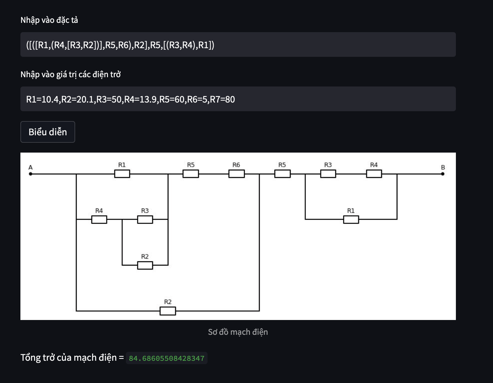

<h1 align="center"><strong> Circuit Visualization </strong></h1>

<h2 align="left"> Description </h2>

The project is built to draw electrical circuits through a specified syntax that I predefined.

<h2 align="left"> How to run </h2>

- Use pip to load required libraries in  `requirements.txt` file

  pip install -r requirements.txt
  
- Run file in terminal

  streamlit run visual.py
 
- Enter the circuit specification you want to draw

  - **[...]**: is parallel circuit.
  - **(...)**: is series circuit.
  - resistors are separated by **","**
  
  Example: ([([R1,(R4,[R3,R2])],R5,R6),R2],R5,[(R3,R4),R1])
  
  - Value for each resistor.
  
  Example: R1=10.4,R2=20.1,R3=50,R4=13.9,R5=60,R6=5,R7=80
  
- Click 'Biểu diễn'

- Finally result
 
   

<h2 align="left"> References </h2>

Framework to draw: [Schemdraw](https://schemdraw.readthedocs.io/en/latest/#)

Framework to create a interface: [Streamlit](https://docs.streamlit.io)
